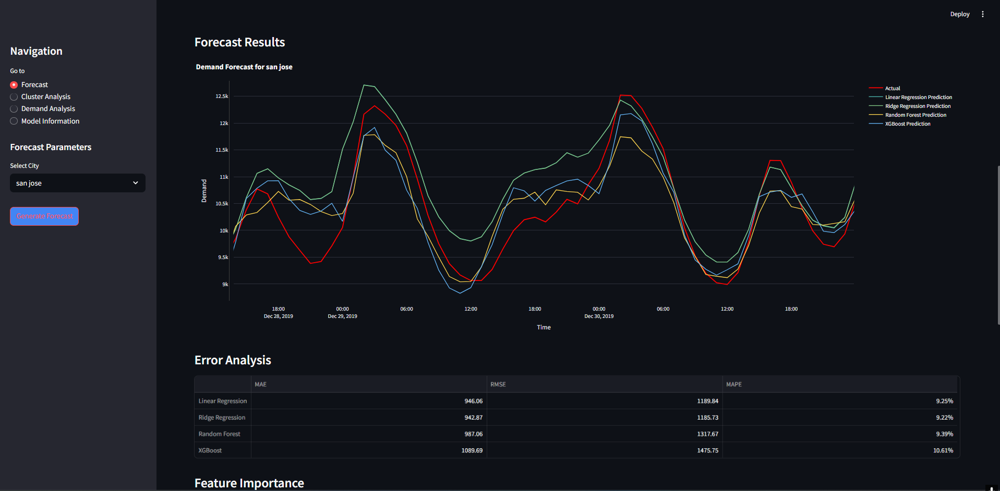
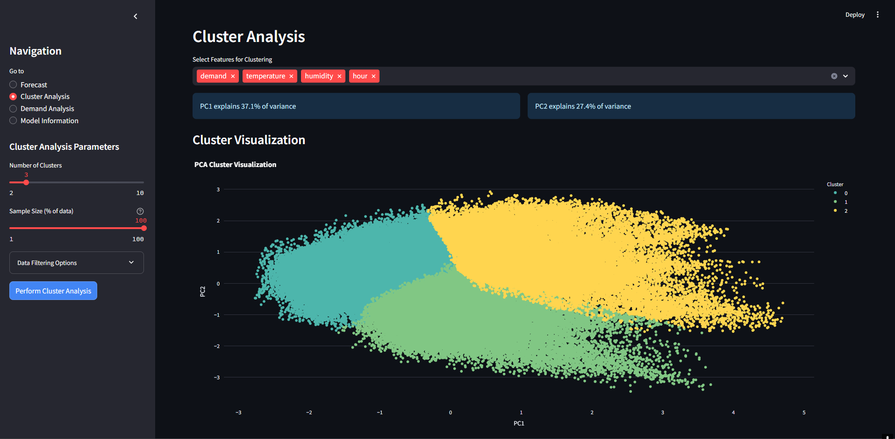
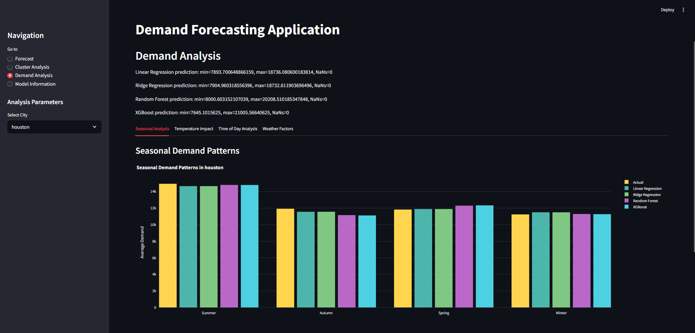
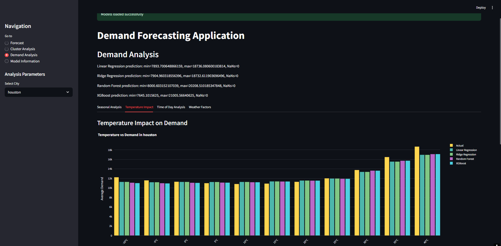
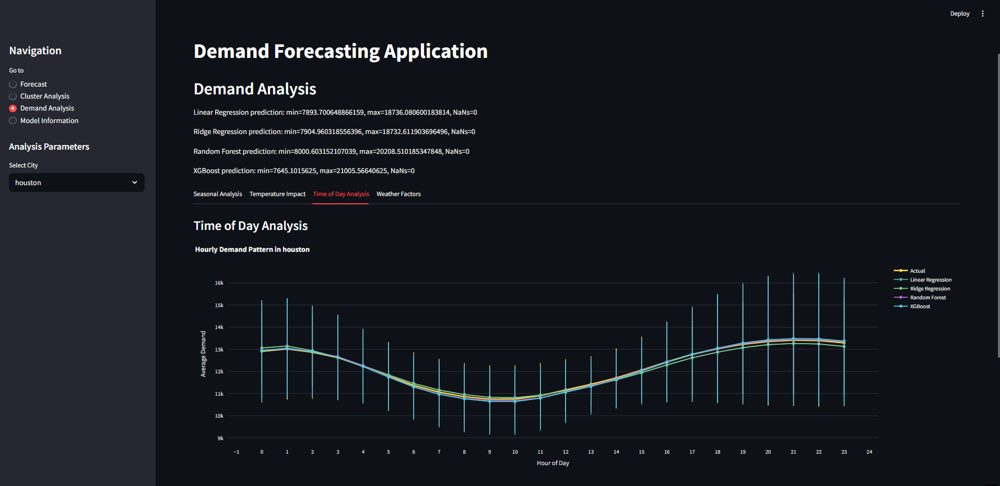
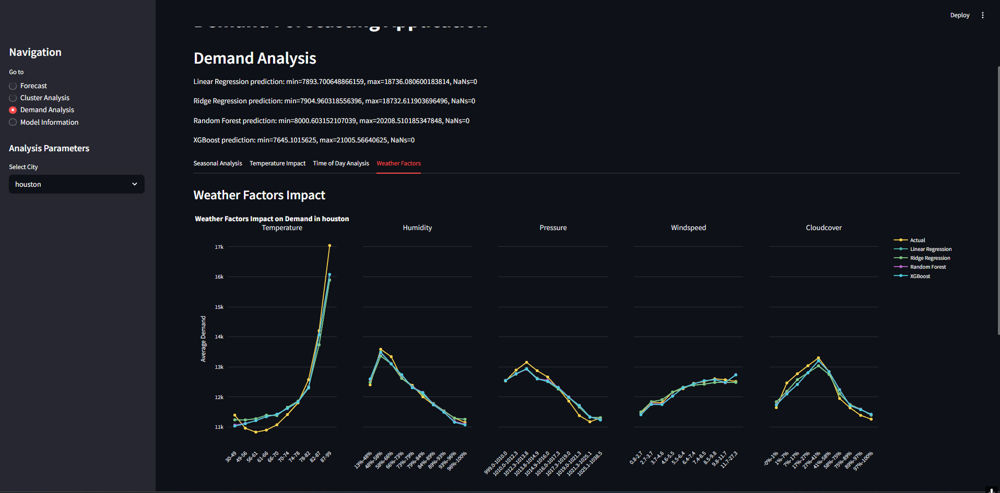

# DemandCast-Electricity-Demand-Forecasting

[](LICENSE)
[](https://www.python.org/)
[](https://streamlit.io/)
[](https://github.com/Saim-Nadeem)

**DemandCast** is an intelligent, interactive dashboard for forecasting electricity demand using multiple machine learning models. It helps energy analysts, researchers, and smart grid operators visualize trends, assess forecast accuracy, and gain insights from real-world electricity and weather data.

---

## 🔍 Features

- 📈 **Forecasting Panel**  
  Predict electricity demand by city and date using several ML models.

- 🧪 **Model Comparison**  
  Compare MAE, RMSE, and MAPE metrics across models with intuitive visuals.

- 🧠 **Feature Importance**  
  Visualize the most influential features in model predictions.

- 📊 **Demand Analysis**  
  Explore correlations with temperature, weather, season, and time of day.

- 🔬 **Cluster Analysis**  
  Discover demand patterns using KMeans clustering and PCA.

- 💾 **Export Options**  
  Download prediction results and visualizations as CSV.

---

## 🧠 Machine Learning Models

- Linear Regression  
- Ridge Regression  
- Random Forest Regressor  
- XGBoost Regressor  
- Ensemble (Mean of multiple models)

---

## 🧰 Tech Stack

| Component     | Technologies Used                                  |
|---------------|-----------------------------------------------------|
| Frontend      | Streamlit, Plotly, Matplotlib                       |
| Backend       | Python, Pandas, NumPy, Scikit-learn, XGBoost        |
| ML Pipelines  | StandardScaler, OneHotEncoder, ColumnTransformer    |
| Clustering    | KMeans, PCA                                         |
| Evaluation    | MAE, RMSE, MAPE                                     |

---

## 📁 Project Structure

```
.
├── predictive_modeling.py       # Script for training and saving models
├── frontend.py                  # Streamlit dashboard code
├── preprocessing.ipynb          # Data cleaning and feature engineering
├── preprocessed_data2.csv       # Cleaned dataset for modeling
├── requirements.txt             # Project dependencies
├── LICENSE                      # MIT License
└── README.md                    # Project documentation
```

---

## 📦 Dataset

This project uses publicly available electricity and weather data:

🔗 **[US Top 10 Cities - Electricity and Weather Data (Kaggle)](https://www.kaggle.com/datasets/shubhamkulkarni01/us-top-10-cities-electricity-and-weather-data)**  
Provided by **Shubham Kulkarni**, it includes hourly electricity usage and weather records for 10 major US cities.

> 📌 **Important:** Run `preprocessing.ipynb` to clean and format this data before training the models.

---

## 🚀 Getting Started

### 1. Clone the Repository

```bash
git clone https://github.com/Saim-Nadeem/DemandCast-Electricity-Demand-Forecasting.git
cd DemandCast-Electricity-Demand-Forecasting
```

### 2. Install Dependencies

```bash
pip install -r requirements.txt
```

### 3. Run Preprocessing

Clean and prepare the dataset by running the notebook:

```bash
jupyter notebook preprocessing.ipynb
```

This will output `preprocessed_data2.csv`.

### 4. Train the Models

```bash
python predictive_modeling.py
```

This will:
- Train multiple ML models
- Save them in the current directory for use in the dashboard

### 5. Launch the Dashboard

```bash
streamlit run frontend.py
```

Open the provided local URL to interact with the **DemandCast** dashboard.

---

## 📸 Screenshots

>   
>   
>   
>   
>   
> 

---


## 🤝 Contributing

Contributions are welcome!  
To propose a change:

1. Open an issue to discuss your idea  
2. Fork the repo  
3. Submit a pull request

---

## 📝 License

This project is licensed under the **MIT License**.  
See the [LICENSE](LICENSE) file for details.

---

## 👤 Author

**Saim Nadeem**  
🔗 GitHub: [https://github.com/Saim-Nadeem](https://github.com/Saim-Nadeem)
